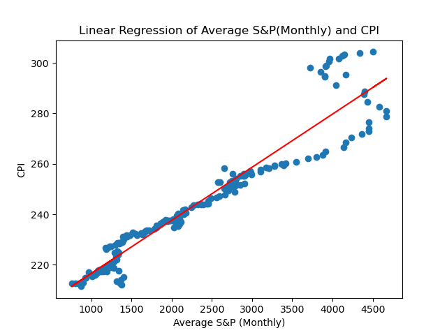
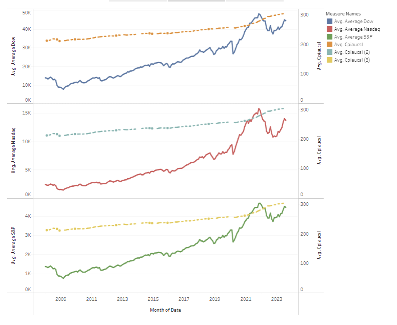
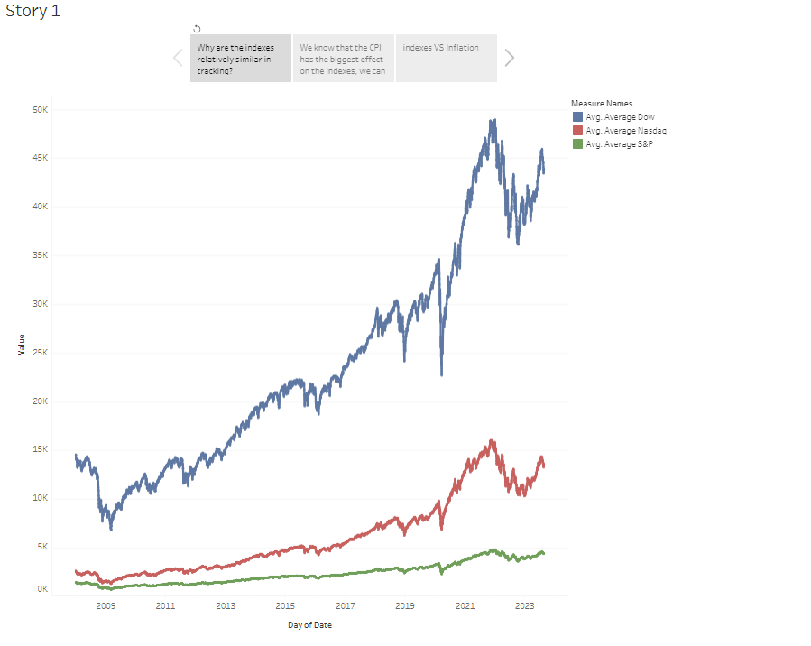
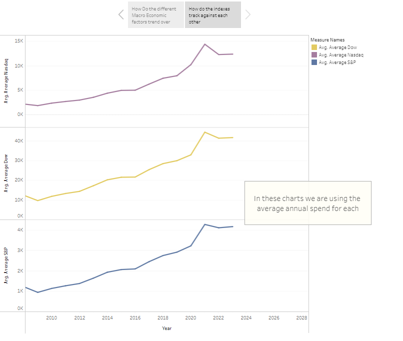
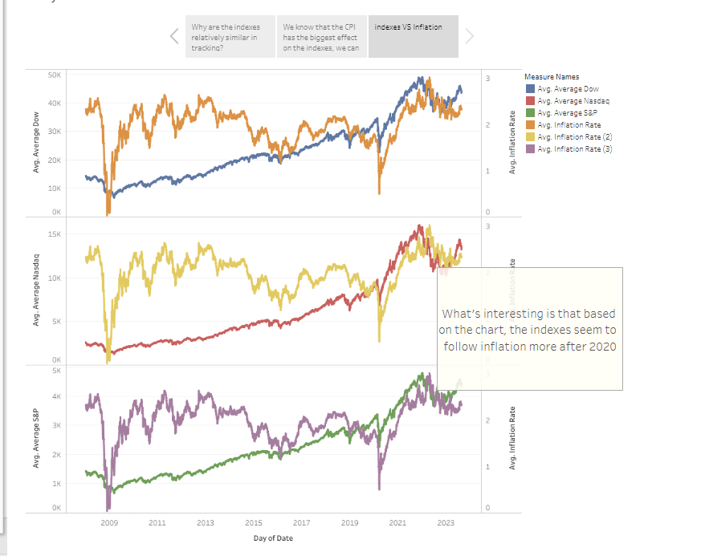
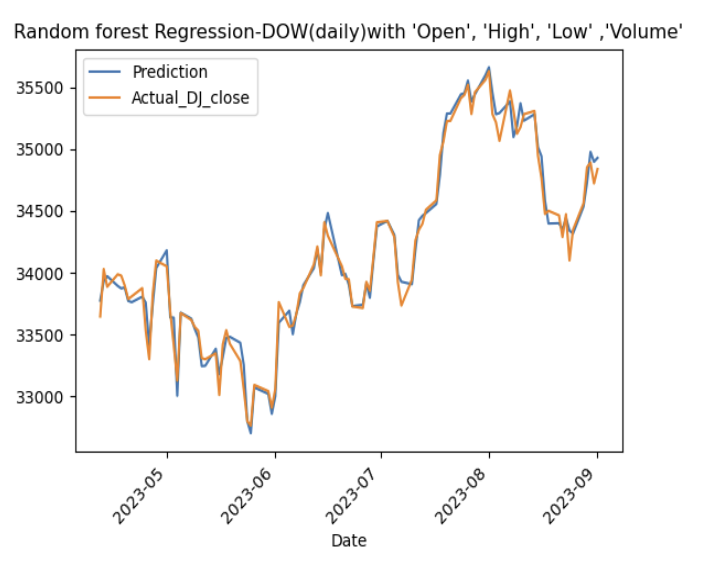
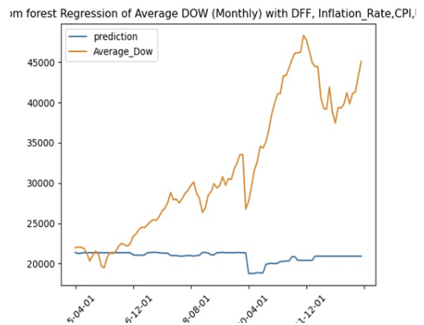

# Macroeconomic-Indicators-and-Index-Correlation

### Stock Indexes vs Macroeconomic Indicators 
# By: Maura Ellsworth, Armine Arutyunyan, Birundha Varatharajan & Ramazan Khaev 

## Summary
For our final project, we decided to take a look at 3 different stock indexes, The Dow Jone, Nasdaq and the S&P. Our goal was to determine how these indexes stand up against various macroeconomic factors (CPI, Unemployment, FedRate (interest rates) and Inflation). We used these factors to then build a Machine Learning Model to determine how the Indexes will perform in the future

## Data Collection

We have found multiple excel sheets via Kaggle to be used and cleaned for our project. 
Daily open, close high and low for Dow Jones, Nasdaq and S&P from 1/2/2008 to present  (we then took the averages of the open and close) 
Daily Inflation  & Fed Funds 
Monthly CPI and Unemployment rate 

## Tools Used

-Python Pandas
-Python Matplotlib
-Machine Learning- Random Forest Regressor
-Tableau 

## Initial Analysis

###AVG CPI and S&P, the correlation is 0.95 that means that as the CPI goes up there is a pretty strong correlation that the S&P will also go upgit 
-Once the data was cleaned, we then did regression lines of the 3 indexes and the macroeconomic factors to see what the highest correlation was 
-The highest correlation was between the indexes and CPI (S&P  VS CPI at 0.95) 
-The lowest correlation was Inflation rate and the indexes (S&P was at 0.23) 

## Tableau Analysis 

# We know that the CPI is the highest correlation, so lets take a look at how that trends over the years

# it's intersting to see that the indexes all trend the same way

# here is a closer look at that 

# inflation had the lowest correlation, yet you can see here that around 2020, the indexes and inflation seem to have similar movements

### [Tableau Story 1](https://public.tableau.com/app/profile/maura.ellsworth/viz/finalllproject/Story1?publish=yesory1?publish=yes)
### [Tableau Story 2](https://public.tableau.com/app/profile/maura.ellsworth/viz/macroandindexes/Story1?publish=yes)

## Machine Learning

A Machine Learning model was created using Random Forest Regressor to predict the closing stock price for the Dow Jones using stock history. 
The model is 98% accurate in predicting the close  

Expected key U.S. macroeconomic indicators like unemployment, inflation and CPI and FDD were going to be among the highly ranked features.
While the stock market is influenced by a many factors, the CPI can significantly influence swings in performance. For instance, reactionary Fed moves can directly impact corporate profits and economic growth, leading the stock value to fluctuate drastically. Higher Fed rate hikes based on CPI often cause the market to dip or slow as traders want to hedge their bets.

Another regressor model will predict the impact of Dow Jones stock price based on Macro economic indicators (CPI,FDD, Inflation Rate, unemployment rate)

## Flask App
A basic flask APP is created to predict DJ stock price, which will ask for the stock ticker name(^DJI) and the year .The  app will run in local host http://127.0.0.1:5000/.

How will the S&P 500, Dow Jone and NASDAQ perform in the future

